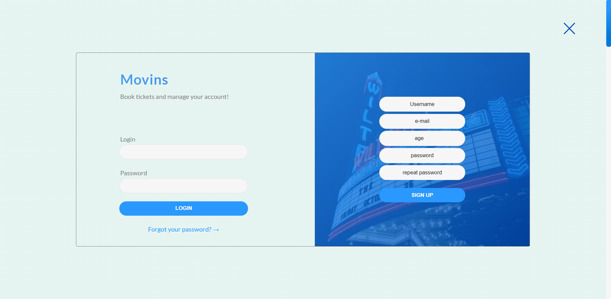
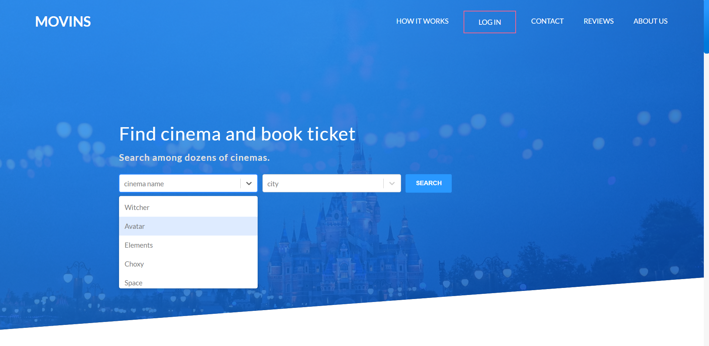
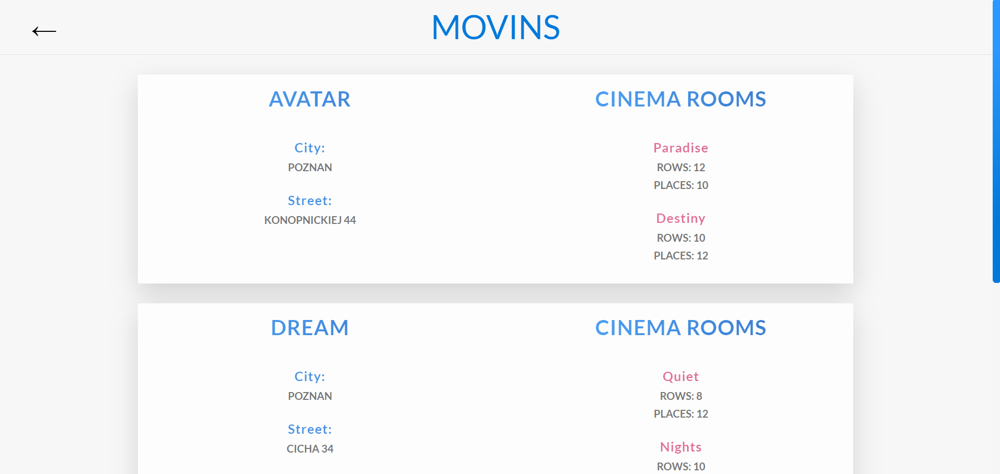
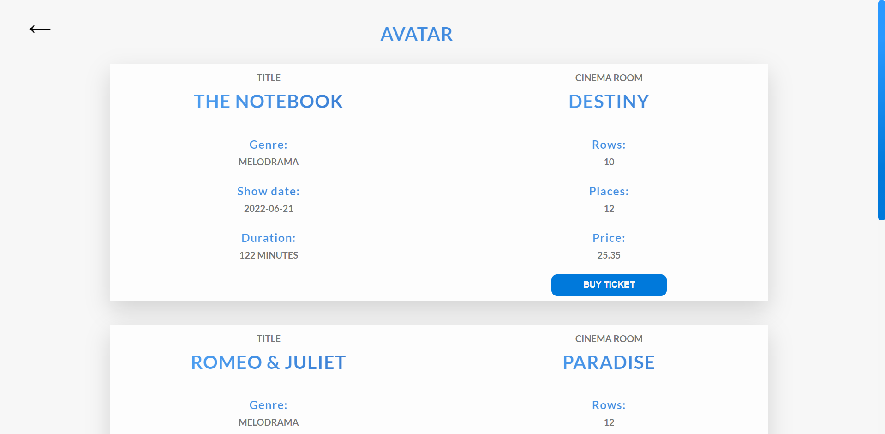
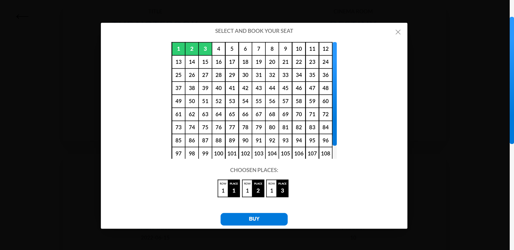
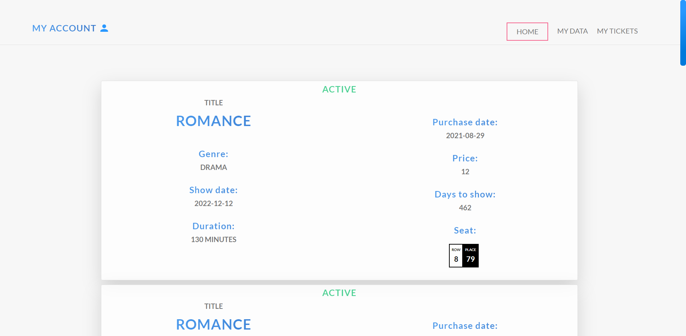
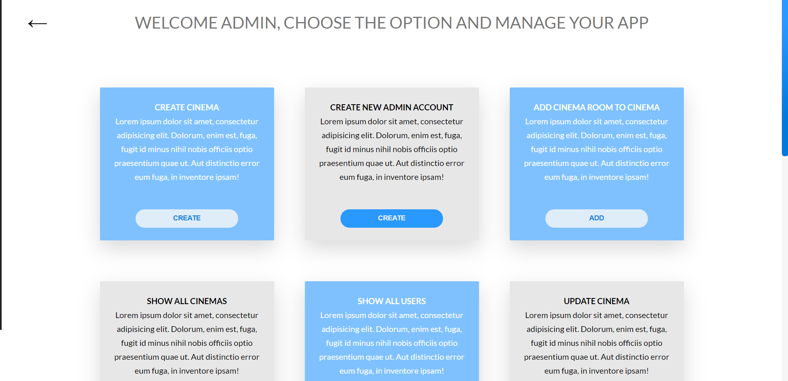

# Movins

## Table of contents :notebook:
* [General info](#general-info)
* [Technologies](#technologies)
* [Installation](#installation)
* [Graphical Representation](#pictures)
***

## General info :information_source:

The aim of this application is to help the user find his favourite cinema 
(if it exists in our database), check what seances this cinema currently shows and book 
the ticket. All of these steps are really easy and fast to do with `Movins` web.
If you are `admin` you are able to manage all of the `cinemas`, `users`, and `seances`. You can create, delete or update new cinemas, add movies etc.  
Backend for this application is built in `Spring` framework - more details here: [movins](https://github.com/Jankaz2/movins/blob/master/README.md) 

I decided to create this application to better understand the concept of commercial 
programs and get better at `React` library. I also mastered `SASS` and `HTML`  

***
## Technologies :computer:

- JavaScript
- React 17.0.2
- Webpack 5.51.1
- SASS 1.38.0
- HTML (JSX)

***

## Installation :hammer:
To run this project locally after you clone this `repository`, all you need to do is to follow these few steps
```angular2html
$ npm install
$ npm run build
$ npm start
```

## Pictures :framed_picture:

It is graphical representation of some examples of use.

### The welcoming login/ registry page
You need to be logged in to the application if you want to order the ticket,
check which seats are already booked etc.  

  

### Home page
As you can see, there are two search bars for `cinema name` and `city`.
There is also navigation with buttons to other sections of `home page`  



### Cinemas list page
If you choose the city you want to find cinema from, the list with all available
cinemas from this city will show to you.  



### Single cinema page

If you finally choose the single cinema, you will see page with all seances
that this cinema currently shows.  




### Buy ticket

The final step is to order your ticket by choosing one of free places
(you need to be logged in to see which are already booked).  



### My tickets

If you are logged in, then from `My accont` tab, you are able to check all of 
the tickets you have already bought



***
### Admin
If you are `ADMIN` there is another page especially created for you to manage the Movins website.
As you can see, there are some panels with specific tasks to do.


